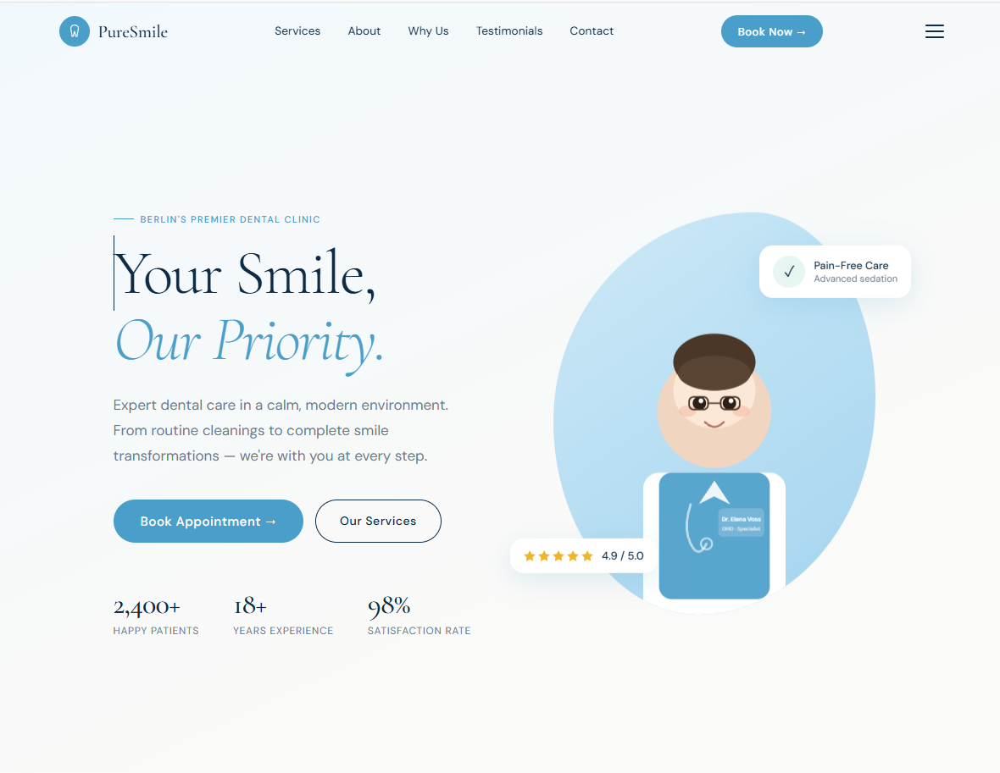
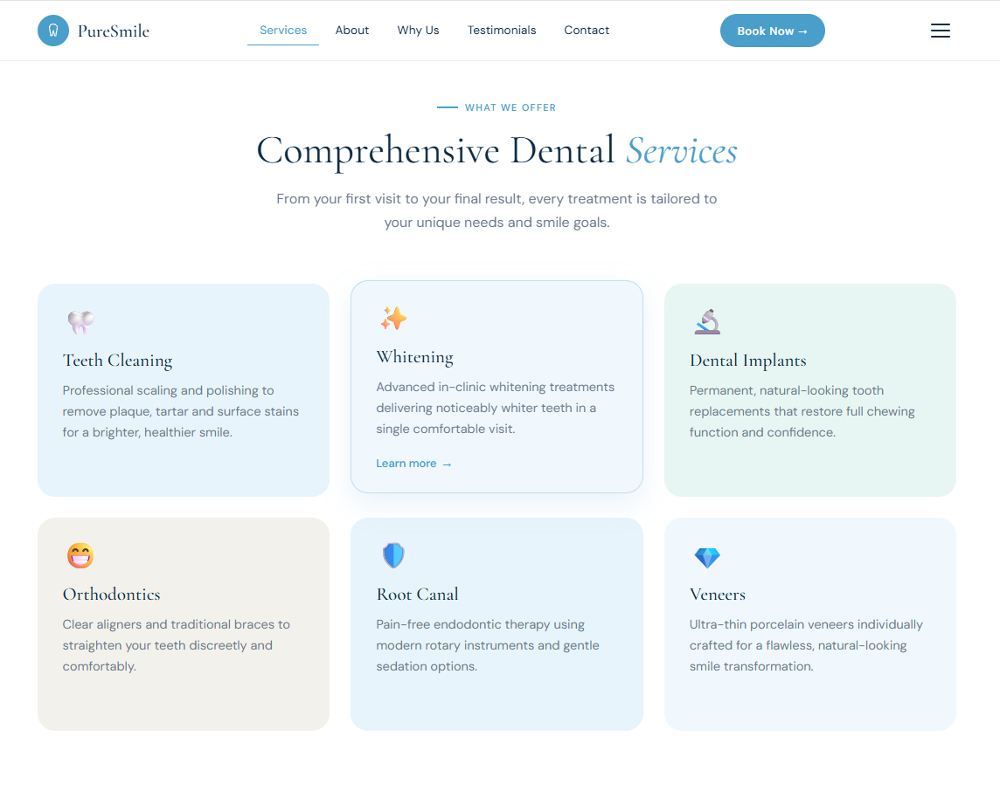
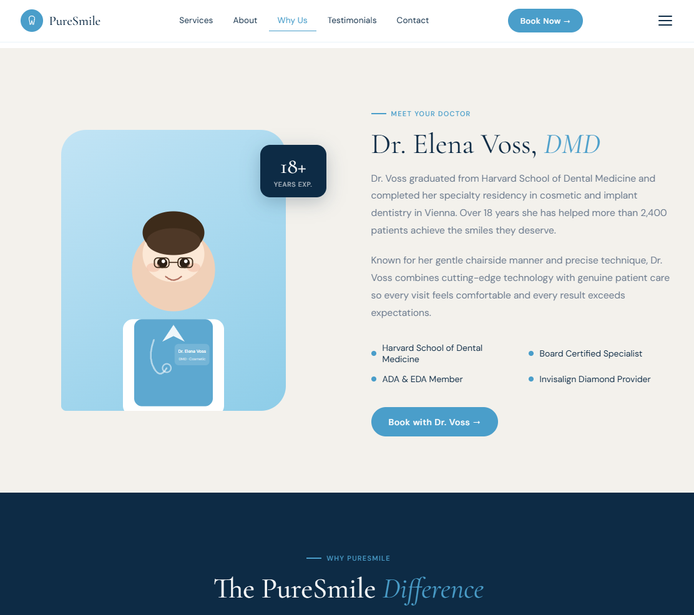

# PureSmile Dental Clinic — Landing Page

A production-ready dental clinic landing page built with **React 18** and pure CSS variables (no Tailwind dependency required — all styling is inline / CSS-variables-based for zero build complexity).

---




## 🚀 Quick Start (3 commands)

```bash
# 1. Install dependencies
npm install

# 2. Start development server
npm start

# 3. Build for production
npm run build
```

The app will open automatically at **http://localhost:3000**

---

## 📁 Project Structure

```
puresmile/
├── public/
│   └── index.html            # HTML shell + Google Fonts
├── src/
│   ├── index.js              # React entry point
│   ├── index.css             # Global resets + CSS variables + animations
│   ├── App.js                # Root component + scroll tracking
│   ├── hooks/
│   │   └── useFadeIn.js      # Reusable IntersectionObserver fade-in hook
│   └── components/
│       ├── ui.js             # Shared primitives (buttons, icons, labels)
│       ├── Navbar.js         # Sticky nav + mobile hamburger
│       ├── Hero.js           # Hero section with illustration
│       ├── Services.js       # 6 service cards
│       ├── About.js          # Doctor bio section
│       ├── WhyUs.js          # 6 reason cards (dark bg)
│       ├── Testimonials.js   # Auto-rotating testimonial cards
│       ├── BookingCTA.js     # Full-width CTA banner
│       ├── Contact.js        # Contact info + validated form
│       └── Footer.js         # 3-column footer
└── package.json
```

---

## ✅ Features

- **Sticky navbar** — transparent → frosted glass on scroll, mobile hamburger
- **Smooth scroll** — all nav links and CTAs scroll smoothly to sections
- **Scroll-triggered animations** — every section fades in via IntersectionObserver
- **Floating hero illustrations** — pure SVG, no external images needed
- **Auto-rotating testimonials** — carousel with dot indicators
- **Form validation** — per-field errors, success state, service selector
- **Fully responsive** — mobile-first, breakpoints at 760 px
- **Accessible** — semantic HTML, ARIA labels, role attributes, aria-current

---

## 🎨 Customisation

All brand colours live in `src/index.css` inside `:root { }`:

| Variable        | Default   | Purpose                  |
|-----------------|-----------|--------------------------|
| `--navy`        | `#0d2b45` | Primary dark colour      |
| `--sky`         | `#4a9eca` | Accent / CTA blue        |
| `--mint`        | `#5bbcaa` | Secondary accent green   |
| `--sand`        | `#f3f1ec` | Light section background |

To swap fonts, edit the Google Fonts `<link>` in `public/index.html` and update the `--serif` / `--sans` variables in `src/index.css`.

---

## 📦 Dependencies

| Package          | Version  | Purpose          |
|------------------|----------|------------------|
| react            | ^18.3.1  | UI library       |
| react-dom        | ^18.3.1  | DOM renderer     |
| react-scripts    | 5.0.1    | CRA build tool   |

No external UI libraries. No Tailwind required.

---

## 🌐 Deploying

### Vercel (recommended — free)
```bash
npm install -g vercel
vercel
```

### Netlify
```bash
npm run build
# Drag the /build folder into netlify.com/drop
```

### GitHub Pages
```bash
npm install --save-dev gh-pages
# Add  "homepage": "https://yourusername.github.io/puresmile"  to package.json
# Add  "predeploy": "npm run build", "deploy": "gh-pages -d build"  to scripts
npm run deploy
```
